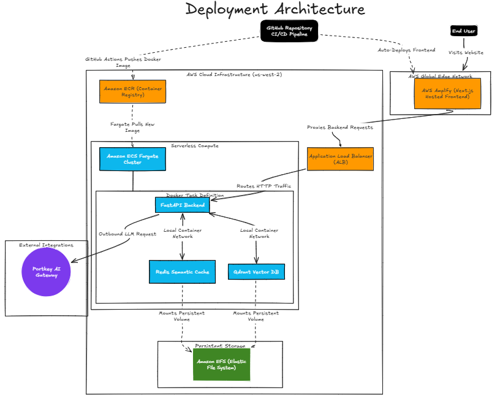
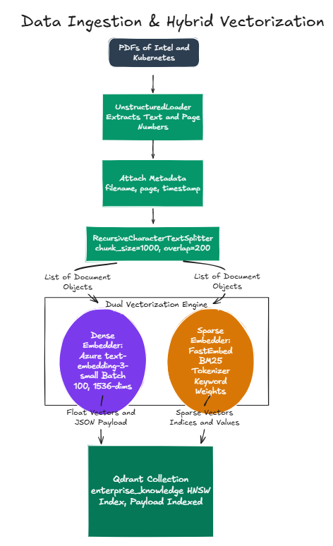
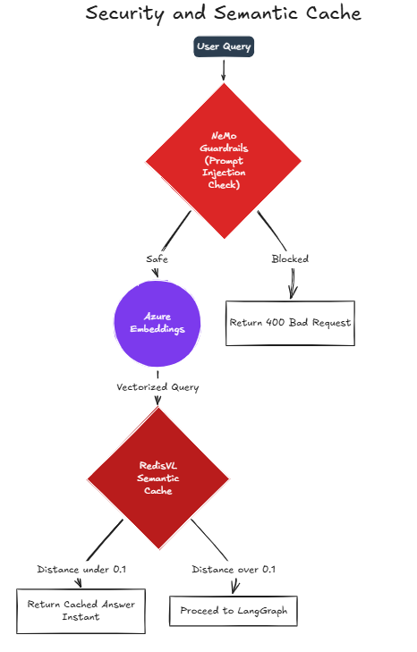
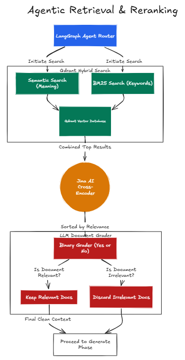
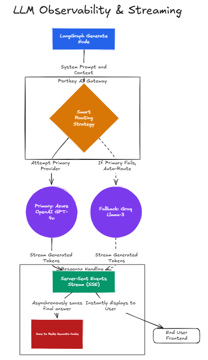

# 🚀 ProductionRAG

An enterprise-grade, highly scalable Retrieval-Augmented Generation (RAG) architecture. Built for zero-hallucination accuracy, sub-second caching, and infinite scalability on AWS.

## Overview

ProductionRAG is designed to solve the critical flaws of standard RAG applications. By implementing a **LangGraph State Machine**, **Hybrid Search**, and **LLM Document Grading (Self-RAG)**, the system guarantees factual accuracy. To ensure enterprise readiness, it features a **Redis Semantic Cache** for zero-cost repeated queries, **Nvidia NeMo Guardrails** for security, and **Portkey AI** for automated LLM failovers.

## Deployment Architecture

The application is fully containerized and deployed on **AWS Serverless Infrastructure**, ensuring high availability and zero-downtime rolling updates via GitHub Actions.

## Core Modules

### 1. Data Ingestion & Dual Vectorization
Documents are parsed and split using optimized chunking strategies (1000 chars, 200 overlap). Every chunk undergoes **Dual Vectorization**: Dense Embeddings (Azure OpenAI) for conceptual meaning, and Sparse Embeddings (BM25) for exact keyword matching.

### 2. Security & Fast-Path Caching
Every incoming query is scanned by **NeMo Guardrails** to prevent prompt injection. Safe queries hit the **RedisVL Semantic Cache**. If a similar question was answered recently (Cosine Distance < 0.12), the cached answer is streamed instantly, saving 100% of LLM costs.

### 3. Agentic Retrieval & Reranking
Cache misses are routed to the **LangGraph Agent**. The agent executes a Hybrid Search in Qdrant, fetching the top 10 results. These are passed to a **Jina AI Cross-Encoder** for deep contextual reranking. Finally, a strict LLM Grader evaluates the top 5 chunks, filtering out any irrelevant data to prevent hallucinations.

### 4. LLM Generation & Observability
Verified context is sent to the Generate Node. Requests are routed through the **Portkey AI Gateway**, which tracks costs and automatically falls back from Azure OpenAI to Groq (Llama-3) in the event of rate limits. The final answer is streamed back to the Next.js UI via Server-Sent Events (SSE).

##  Technology Stack
* **Frontend:** Next.js, React, AWS Amplify
* **Backend:** FastAPI, Python, LangGraph
* **Databases:** Qdrant (Vector DB), Redis (Semantic Cache)
* **Cloud Infrastructure:** AWS ECS Fargate, ALB, EFS, ECR
* **AI & Security:** Azure OpenAI, Groq, Jina AI, Nvidia NeMo, Portkey
 📚 Documentation
For a deep dive into the engineering decisions and performance metrics of this architecture, please refer to the following documents:
* [🏛️ Architectural Decisions Record (ADR)](architectural_decisions.md) - Details the exact "why" behind our algorithms (BM25, Reranking, Self-RAG) and AWS Infrastructure choices.
* [📊 Load Testing & Capacity Report](results.md) - Official metrics from simulating 500 concurrent users against the live AWS architecture.
